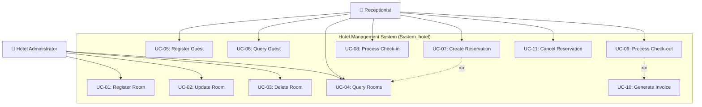
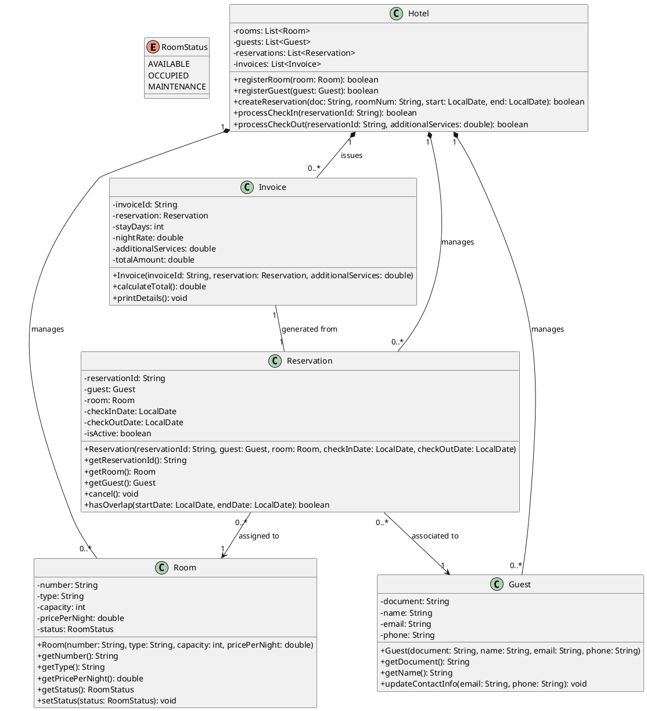
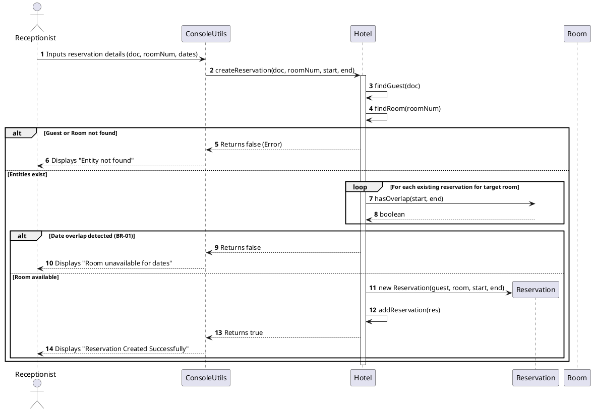
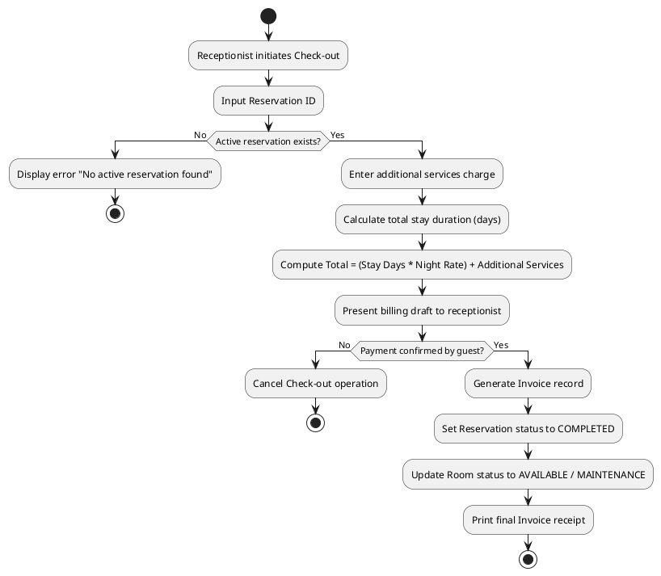

# Software Architecture & UML Diagrams Specification

## Project: Hotel Management System (`System_hotel`)

This document provides the standard Object-Oriented Analysis and Design (OOAD) models for the Hotel Management System using UML 2.5 standards in PlantUML and Mermaid formats.

---

## 1. Use Case Diagram

Defines the system boundaries and interactions between actors (`Administrator` and `Receptionist`) and functional capabilities.

---

## 2. Class Diagram (Domain & Application Model)

Presents object structures, memory references, encapsulation rules, and relationships adhering to SOLID design principles.

---

## 3. Sequence Diagram (Reservation Creation Workflow)

Models message exchanges between domain components to satisfy business rules (overbooking check).

---

## 4. Activity Diagram (Check-out & Billing Process)

Defines operational workflows, decision nodes, and system state transitions during guest check-out and invoice issue.

